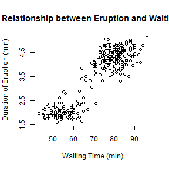
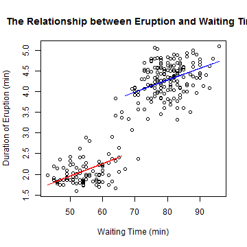

## Background
Old Faithful is a cone geyser located in Wyoming, in Yellowstone National Park in the United States. It is one of the most predictable geographical features on Earth, erupting almost every 63 minutes.

This project is focused on the relationship between the durations of eruptions and the waiting times from the built-in dataset `faithful`. 

---

## Exploratory Data Analysis
First, perform some exploratory data analysis by plotting the durations of eruptions against the waiting times. 


```r
  plot(faithful$waiting, faithful$eruptions, 
       main="The Relationship between Eruption and Waiting Time",
       xlab="Waiting Time (min)",
       ylab="Duration of Eruption (min)")
```

 

---

## Exploratory Data Analysis (Continued)
Second, divide `faithful` to two subsets `low_wt` and `high_wt` based on whether the waiting time is <67 min,as the scatter plot shows that the durations of eruptions are much shorter when the waiting time is <67 min. 

Third, perform two sample T-test on `low_wt` and `high_wt`.


```r
  low_wt <- faithful[faithful$waiting < 67,]
  high_wt <- faithful[faithful$waiting >= 67,]
  t.test(low_wt$eruption, high_wt$eruption, paired=FALSE, var.equal=FALSE)
```

```
## 
## 	Welch Two Sample t-test
## 
## data:  low_wt$eruption and high_wt$eruption
## t = -41.6138, df = 226.626, p-value < 2.2e-16
## alternative hypothesis: true difference in means is not equal to 0
## 95 percent confidence interval:
##  -2.295247 -2.087707
## sample estimates:
## mean of x mean of y 
##  2.093939  4.285416
```

---

## Regression Model
Four, build a linear model for each of the subsets, and then create a new scatter plot with the regression lines. 


```r
  low_wt_lm <- lm(eruptions ~ waiting, data=low_wt)
  high_wt_lm <- lm(eruptions ~ waiting, data=high_wt)
```

 

---

## Conclusion
1. When the waiting time is <67 min, the durations of eruptions are shorter.The difference is statistically significant (*p*-value < 0.001).
2. When the data is divided into two subsets based on the waiting time, each subset shows a linear relationship between the duration of eruption and the waiting time. 

